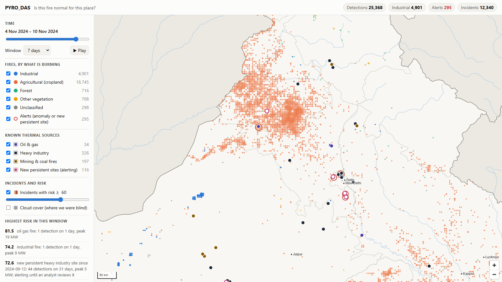
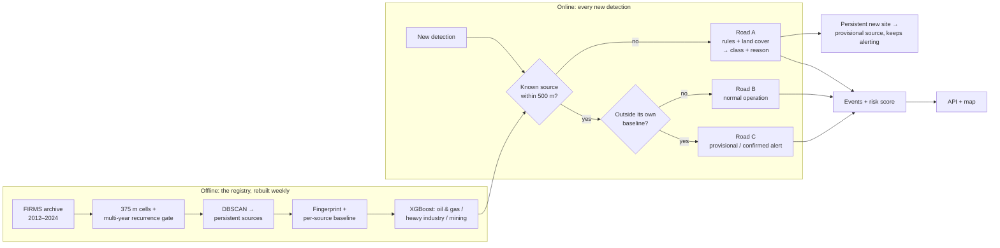
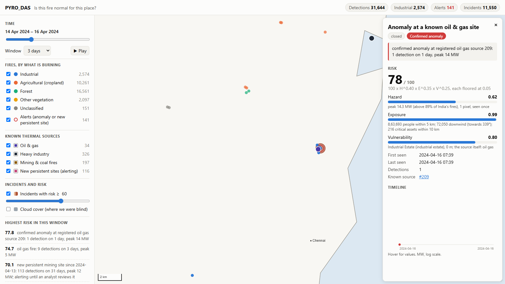
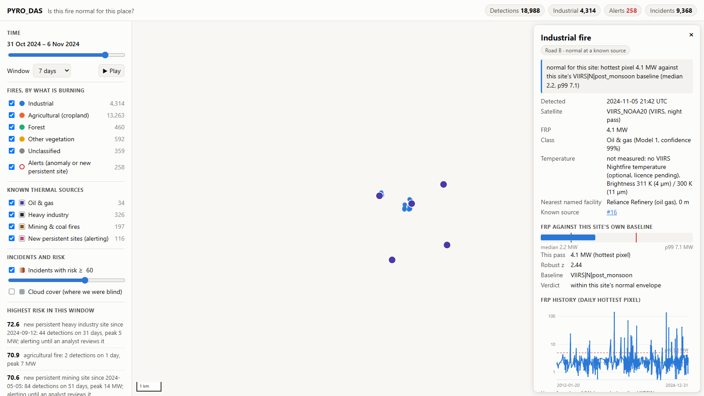

# PYRO_DAS

**Satellite detection and classification of industrial fires and persistent thermal
sources over India.**


NASA FIRMS reports that a pixel is hot, but not *what* is hot. A refinery flare, a stubble
fire, a forest fire and a chemical-plant explosion all arrive as the same point.
PYRO_DAS learns the thermal fingerprint of every recurring heat source in India from
thirteen years of satellite history. For each new detection it then answers the question
FIRMS cannot: **is this fire normal for this place?**

Built for Smart India Hackathon 2026, problem statement **26162** (National Technical
Research Organisation, Disaster Management).



*One week of November 2024. Stubble fires (orange) are separated from industrial heat
(blue), known thermal sources (dark markers) and alerts (red rings), and every point carries
the reason for its class.*

---

## How it works



- **The registry.** Recurring heat is gridded, gated on recurrence across several years,
  and clustered into physical sources, so crop and forest landscapes never become
  "sources".
- **Fingerprints and baselines.** Each source gets a fingerprint (persistence over the
  nights it was observable, seasonality, FRP distribution) and a robust baseline (median,
  MAD, p99) per instrument, day/night and season.
- **Classification.** One gradient-boosted model classifies each source from its
  fingerprint alone.
- **Routing.** Each new detection is routed three ways:
  - **Road A** (no known source): transparent rules on land cover and mapped industry.
  - **Road B** (a known source, within its normal envelope): normal operation, no alert.
  - **Road C** (a known source, breaching its own baseline): an alert, provisional on one
    extreme pass, confirmed on two consecutive breaching passes.
- **No accident is absorbed.** A new site that keeps burning is promoted to a provisional
  source and keeps alerting until an analyst confirms it.
- **Events and risk.** Detections are assembled into incidents and scored as
  hazard × exposure × vulnerability, with the decomposition shown.

The full design, with the reasoning and evidence behind each rule, is in
[docs/DESIGN.md](docs/DESIGN.md).

## Results

Measured on the real FIRMS archive for India: 12.55 M detections, 2012–2024.

| Measure | Result | Report |
|---|---|---|
| Persistent sources found | **557**; 83.4% of active GIHS industrial sites recovered; 86.2% of sources on a GIHS site | [Registry](reports/stage3_registry.md) |
| Stubble belt misrouted into the registry | **0.014%** of 1.34 M Punjab detections (raw clustering, 2021–2023: 97%) | [Registry](reports/stage3_registry.md) |
| Source sub-type (oil & gas / heavy industry / mining) | **65.2%** accuracy, 61.2% balanced, spatial cross-validation; location-only reference 40.8% | [Model](reports/stage4_model1.md) |
| 2024 detections classified, each with a reason | **1.20 M**: agricultural 496 k, forest 411 k, industrial 178 k, other 109 k | [Inference](reports/stage5_inference.md) |
| Anomaly alerts on spikes injected into real histories | **88.2%** confirmed recall at **0.040%** false alerts | [Inference](reports/stage5_inference.md) |
| Verified industrial accidents flagged | **1 of 18**; FIRMS itself saw only 6 of the 18 | [Validation](reports/validation.md) |

The last row is the headline measure, and the validation report explains it accident by
accident. Most sudden accidents burn out between the two daily passes of a polar-orbiting
satellite, so they never appear in FIRMS at all. PYRO_DAS is strong on persistent
industrial heat. Sub-hourly detection of accidents needs geostationary data
(INSAT-3DS, Himawari), which the same registry and baselines would support unchanged.

| A confirmed anomaly, with its risk decomposition | Road B: a refinery judged against its own baseline |
|---|---|
|  |  |

## Quick start

**Requirements:** Python 3.13, and PostgreSQL 16 with PostGIS (Docker, or the portable
Windows install below).

Linux, macOS or Git Bash:

```bash
make install     # .venv with Python 3.13, dependencies, and .env from .env.example
make db          # start PostgreSQL + PostGIS (Docker)
make migrate     # apply the schema
make test        # the database tests must run, not skip
```

Windows PowerShell (5.1 or 7):

```powershell
.\make.ps1 install
.\make.ps1 db        # without Docker: .\scripts\local_postgres.ps1 install first
.\make.ps1 migrate
.\make.ps1 test
```

`scripts\local_postgres.ps1 install` sets up a portable PostgreSQL 16 + PostGIS under
`%LOCALAPPDATA%\firewatch`, with no administrator rights and no service.

Then build the data and run the system (the same targets work with `make`):

```powershell
.\make.ps1 backfill   # FIRMS 2012-2024, OSM, GIHS, cloud cover (~1 GB download)
.\make.ps1 registry   # persistent sources, fingerprints and baselines
.\make.ps1 labels     # weak labels from OpenStreetMap and power-plant data
.\make.ps1 train      # the source classifier, with its leakage guard
.\make.ps1 inference  # route the latest year through Roads A, B and C
.\make.ps1 events     # assemble detections into incidents
.\make.ps1 risk       # score every incident
.\make.ps1 basemap    # the offline basemap
.\make.ps1 api        # the map at http://localhost:8000, API docs at /docs
```

Two further targets check the result:

```powershell
.\make.ps1 validate   # replay every verified industrial accident
.\make.ps1 demo       # the three-minute demonstration (-Check verifies it)
```

No credentials are needed: the FIRMS archive for India is public. A free
`FIRMS_MAP_KEY` is needed only for 2025 onward and the live feed. VIIRS Nightfire
temperatures are optional. `MOCK_MODE=1` switches to a small synthetic fixture for
offline tests.

## Repository layout

The Python package, database and command names use the code name `firewatch`.

```
firewatch/
  ingest/       FIRMS, OpenStreetMap, WorldCover, GIHS, cloud, wind, basemap loaders
  registry/     375 m cells, recurrence gate, clustering, fingerprints, baselines
  models/       weak labels and the source classifier
  inference/    router, Road A rules, anomaly test, promotion, events
  risk/         asset register, population, risk score
  api/          FastAPI service and vector tiles
web/            the map (MapLibre GL, served by the API; works offline)
sql/            database schema, applied in order by scripts/migrate.py
scripts/        one script per pipeline step, each with a check script
tests/          unit and database tests (pytest)
reports/        results of each stage, with figures
reference/      verified industrial accidents; a synthetic benchmark
docs/           design, roadmap, images
```

## Documentation

| Document | Contents |
|---|---|
| [docs/DESIGN.md](docs/DESIGN.md) | Architecture, design principles and the evidence for each, data sources, decision log |
| [docs/ROADMAP.md](docs/ROADMAP.md) | The build stages, each with its acceptance test and result |
| [reports/validation.md](reports/validation.md) | Every headline number, accident-by-accident validation, limitations |
| [reports/stage3_registry.md](reports/stage3_registry.md) | The registry on the full archive |
| [reports/stage4_model1.md](reports/stage4_model1.md) | Weak labels and the source classifier |
| [reports/stage5_inference.md](reports/stage5_inference.md) | Routing a year of detections; anomaly detection on injected spikes |
| [reports/stage6_events.md](reports/stage6_events.md) | From detections to incidents |
| [reports/stage7_risk.md](reports/stage7_risk.md) | Risk scoring and its decomposition |
| [reports/stage1_5b_multiyear.md](reports/stage1_5b_multiyear.md) | Why raw clustering fails: three years of real data |

## Data sources

| Source | Use | Licence / terms |
|---|---|---|
| [NASA FIRMS](https://firms.modaps.eosdis.nasa.gov/) (VIIRS, MODIS) | Fire detections, 2012–2024 | NASA open data |
| [OpenStreetMap](https://www.openstreetmap.org/) via Geofabrik | Industrial facilities, weak labels | ODbL |
| [ESA WorldCover 2021](https://esa-worldcover.org/) | Land cover | CC BY 4.0 |
| [WRI Global Power Plant Database](https://datasets.wri.org/dataset/globalpowerplantdatabase) | Power plants, weak labels | CC BY 4.0 |
| [GIHS](https://doi.org/10.5281/zenodo.10570342) (Ma et al. 2024) | Evaluation of the registry only | CC BY 4.0 |
| [NASA POWER](https://power.larc.nasa.gov/) | Daily cloud amount and wind | NASA open data |
| [WorldPop](https://www.worldpop.org/) 2020, 1 km | Population exposure | CC BY 4.0 |
| [Natural Earth](https://www.naturalearthdata.com/) | Offline basemap | Public domain |
| [MapLibre GL JS](https://maplibre.org/) | Map rendering (vendored) | BSD-3-Clause |

---

Developed for Smart India Hackathon 2026, problem statement 26162.
