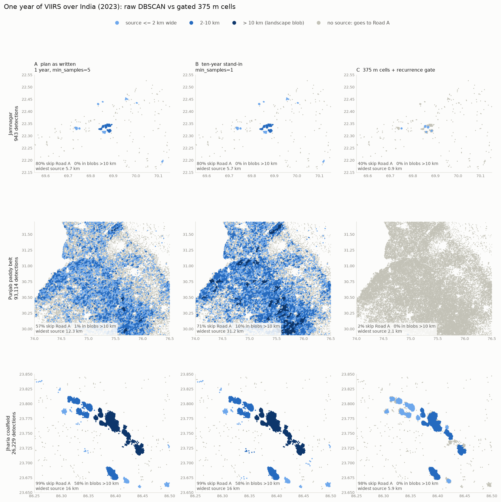
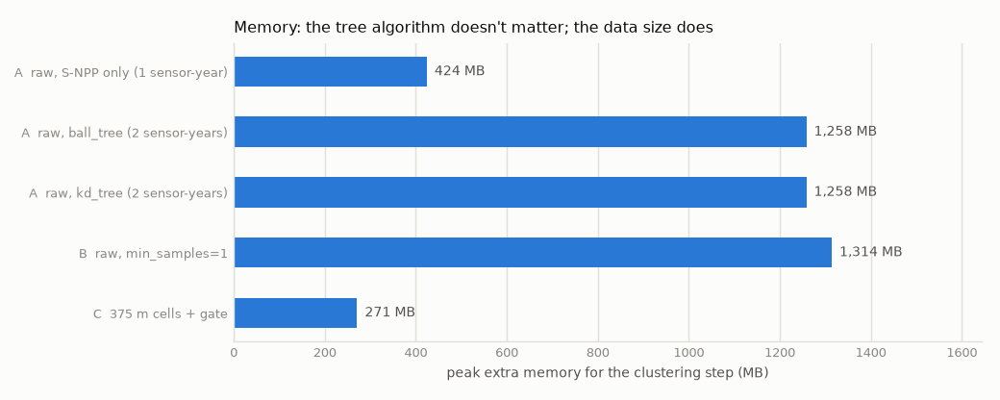
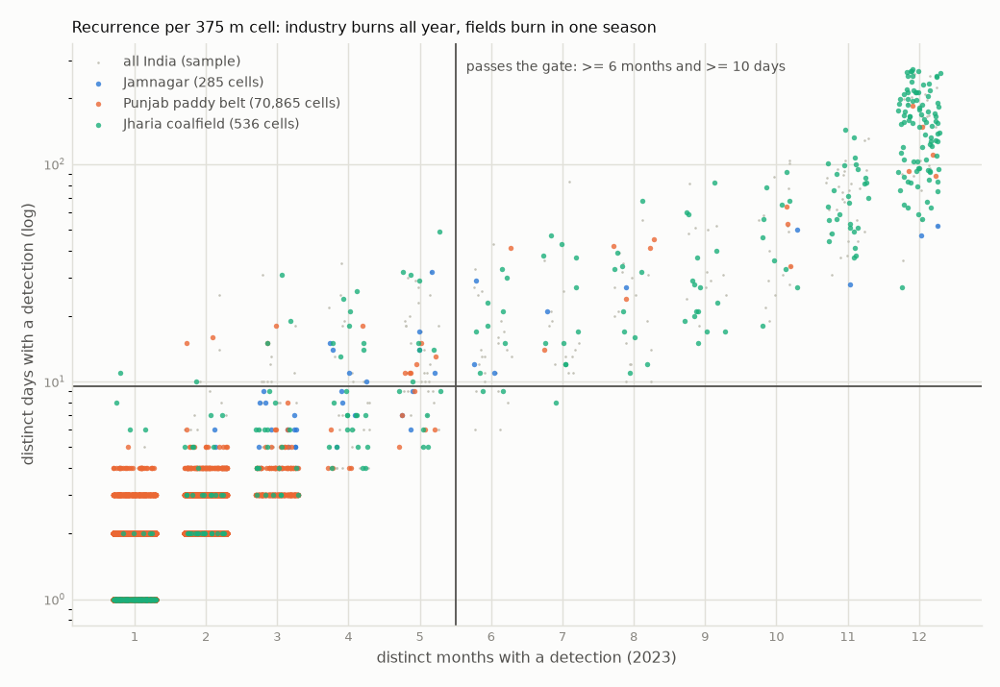
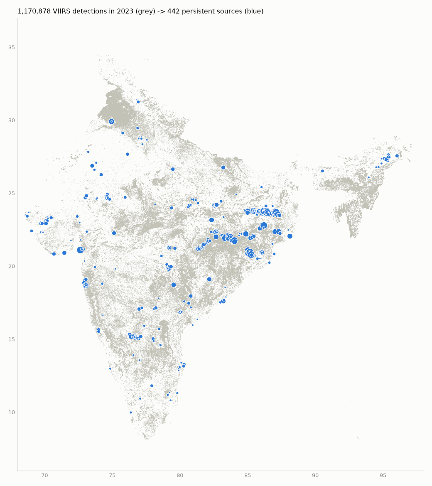

# Stage 1.5 — real-data clustering spike

**Date:** 2026-09-29 · **Data:** all VIIRS detections over India in 2023 (S-NPP + NOAA-20)
· **Script:** `scripts/spike_cluster.py` · **Rerun:** `.\make.ps1 spike` or `make spike`

> **Superseded in part by `reports/stage1_5b_multiyear.md`.** This one-year test
> concluded that raw DBSCAN does *not* merge the Punjab paddy belt into one blob.
> Three years (2021–2023) show that it does: a single cluster of 365,996 detections
> spans the whole belt, 400 km corner to corner, 99% of it in stubble months. One year
> was too little history, and the ten-year stand-in below understated the effect, as
> its caveat warned. Everything else here stands. The proposed gate (≥ 4 months,
> ≥ 10 days, in ≥ 2 years) was confirmed on three years without change.

Before Stage 3 is built on them, this spike tests two claims from the design review:

1. Raw DBSCAN over years of detections chains farm and forest landscapes into "sources",
   so stubble fires silently skip Road A.
2. `algorithm="ball_tree"` does not fix DBSCAN's memory problem.

## Answers

**Problem 1 is real, but not in the form predicted.** The review predicted the whole
paddy belt merging into *one* source. It didn't. One year of raw DBSCAN breaks the belt
into thousands of field-scale clusters: the widest is 12 km (31 km in the ten-year
stand-in). The consequence that matters did happen, though:

- **57% of the Punjab paddy belt's 93,114 detections land inside a "source"** (72% in
  the ten-year stand-in). With the gated method, 1.8% do.
- One year of raw DBSCAN registers **33,963 "sources" across India**, against 442 from
  the gated method.
- **46% of every detection in India** would then skip Road A, against 15% with gating.
  The 15% sit at genuinely persistent sites; FIRMS itself flags 12.7% of all
  detections as static.
- Dense landscapes do chain: the Jharia coalfield becomes one 16 km blob.

**Problem 2 is real, exactly as stated.** `ball_tree` and `kd_tree` produce identical
labels and identical peak memory (1,258 MB each). scikit-learn's `"auto"` already picks
`kd_tree` for this data, so switching to `ball_tree` changed nothing. Memory grows with
data size: doubling the points multiplied the neighbour lists by 3.8× and peak memory by
3.0×. Extrapolated to the full 2012–2024 VIIRS archive, raw DBSCAN needs roughly
**45–70 GB**. The gated method clustered the same year in **271 MB and 2.4 s**.

**The replacement works.** From 832,550 cells, 2,043 pass the recurrence gate and
form 442 sources, the widest 6.8 km. It needs no labels, yet it lines up with the two
independent references:
- **99.1% of the detections FIRMS flags as static** fall within 500 m of one of our
  sources.
- **83% of our sources sit on an imagery-verified GIHS industrial site.**

It finds exactly one source inside the paddy belt: the HMEL Guru Gobind Singh refinery
near Bathinda.

**Proposed starting gate for Stage 3:** a 375 m cell burns in **≥ 4 distinct months
and on ≥ 10 distinct days within a year, in at least 2 years**. Stage 3 calibrates this
against GIHS on the full archive.

## Data

| | |
|---|---|
| Files | `viirs-snpp_2023_India.csv` (45.4 MB), `viirs-jpss1_2023_India.csv` (47.4 MB) — FIRMS country yearly archive, public, no key |
| Detections | 1,170,878 after normalisation and dedupe (S-NPP 579,733 · NOAA-20 591,145), all SP |
| At night | **29.0%** |
| FIRMS `type` | 0 vegetation 1,020,141 · 1 volcano 4 (Barren Island) · **2 static land source 148,382 (12.7%)** · 3 offshore 2,351 |

The file went through the production normaliser (`firewatch/ingest/normalize.py`)
unchanged. That doubled as a real-data test of it.

## Method

| Run | What | Stands for |
|---|---|---|
| **A** | DBSCAN on every detection, `eps=500` m, `min_samples=5`, `ball_tree` | The original plan |
| A_kd | Same with `kd_tree` | Does the tree matter? |
| A_snpp | Same on S-NPP only (half the points) | How does memory scale? |
| **B** | Same with `min_samples=1` | Ten years (see below) |
| **C** | 375 m cells → recurrence gate (≥ 6 months, ≥ 10 days) → DBSCAN on surviving cells with `sample_weight` → 20 km footprint cap | The replacement |

Each run executes in a fresh process, and its memory is the peak working set minus the
memory before clustering. The neighbour-list sizes are counted separately with a k-d tree.

**Why B stands for ten years.** Paddy fields burn year after year. With ten years of
data, nearly every point has ≥ 5 neighbours within 500 m, which is what
`min_samples=1` does to one year. Ten years also only *add* links. So B understates
ten-year chaining where fields recur, and overstates it where they don't.

**"Skip Road A"** means a detection falls inside a registered source's footprint (A, B),
or within 500 m of a registered source cell (C). That is the router's question.
Clusters under 5 detections don't count as sources. Region boxes are approximate:
Jamnagar 22.15–22.55 N, 69.55–70.15 E; Punjab 29.9–31.7 N, 74.0–76.5 E; Jharia
23.65–23.85 N, 86.25–86.50 E.

## Problem 1 — what raw DBSCAN does to landscapes



| Run | Region | Detections | Skip Road A | In blobs > 10 km | Widest source |
|---|---|---|---|---|---|
| A | Jamnagar | 943 | 79.8% | 0.0% | 5.7 km |
| A | Punjab paddy belt | 93,114 | **57.4%** | 1.1% | 12.3 km |
| A | Jharia coalfield | 26,229 | 99.2% | **58.4%** | 16 km |
| B | Jamnagar | 943 | 79.8% | 0.0% | 5.7 km |
| B | Punjab paddy belt | 93,114 | **71.5%** | 9.9% | 31.2 km |
| B | Jharia coalfield | 26,229 | 99.2% | 58.4% | 16 km |
| C | Jamnagar | 943 | 40.3% | 0.0% | 0.9 km |
| C | Punjab paddy belt | 93,114 | **1.8%** | 0.0% | 2.1 km |
| C | Jharia coalfield | 26,229 | 97.8% | 0.0% | 5.9 km |

Nationally, A produces 33,963 clusters and B 39,067, against 442 for C. 32 of A's
clusters and 98 of B's are wider than 10 km; the widest are 19.7 km (A) and 31.2 km (B).

**The prediction was wrong in form but right in consequence.** The belt does not merge
into a single blob in one year. It becomes a mosaic of 2–10 km clusters of stubble
fires, each of which would enter the registry, get a fingerprint and a baseline, and
pull the fires around it off Road A. Whether ten real years merge it further is
untested. It doesn't need to be: the registry is already wrong at 57%.

**Absorption is a smaller, real effect.** 40 of the 442 persistent sources (9%) sit
inside raw clusters made mostly of one-off fires; the median contamination is 13%. The
clearest case is Jamnagar: its two largest flare groups fall in a 5.7 km raw cluster
that is 55% one-off detections. A baseline built on that cluster would be built mostly
on fires that aren't the refinery. The HMEL refinery in the paddy belt, by contrast,
stayed clean under raw DBSCAN too (a 4.8 km cluster, 7% of it in October–November).

## Problem 2 — does `ball_tree` save memory?



| Run | Points | Seconds | Peak extra memory |
|---|---|---|---|
| A_snpp (1 sensor-year) | 579,733 | 4.9 | 424 MB |
| A, `ball_tree` (2 sensor-years) | 1,170,878 | 11.4 | **1,258 MB** |
| A_kd, `kd_tree` (2 sensor-years) | 1,170,878 | 10.8 | **1,258 MB** |
| B, `min_samples=1` | 1,170,878 | 10.1 | 1,314 MB |
| C, gated cells | 1,170,878 | 2.4 | 271 MB |

- `ball_tree` and `kd_tree` give identical labels and identical memory, because DBSCAN
  stores every point's neighbour list whichever tree finds it. scikit-learn's `"auto"`
  resolves to `kd_tree` on this data anyway.
- 2.02× the points gave 3.81× the neighbour entries (30.3 M → 115.4 M) and 2.97× the
  peak memory.
- The full VIIRS archive for 2012–2024 is about 20 sensor-years, roughly 10× this data.
  At the measured growth rates that is about 44 GB peak, or 69 GB for the neighbour
  lists alone — more than this machine's 32 GB. The 330k-point blow-up in `docs/plan.md`
  fits this pattern: it was the data size, not the tree.
- C's 271 MB is mostly the per-cell aggregation, which grows linearly with detections.
  The DBSCAN step itself runs on 2,043 cells.

## The replacement — gated 375 m cells



Recurrence separates the two worlds cleanly:
- **Punjab cells** (orange) almost all burn in 1–3 months, on fewer than 10 days.
- **Jharia cells** (green) run up to 12 months and 100–300 days.

The few Punjab cells in the upper right are the refinery.



- **442 sources**, concentrated in the coal and steel belt of Jharkhand, Odisha and
  Chhattisgarh, plus Gujarat and the Upper Assam oilfields. By location, the largest
  are the Jharia coalfield (10,072 detections, 287 nights), Talcher–Angul, Hazira, the
  Raniganj coalfield and Jamshedpur. These names come from coordinates and have not
  been checked against imagery.
- **Punjab:** the one real source is the HMEL refinery at 29.91 N, 74.95 E: 1,453
  detections on 234 nights, in all 12 months, 88% FIRMS-static. The refinery sits at
  29.931 N, 74.946 E. The other 91,000 detections go to Road A.
- **Jharia:** split into 15 sources, none wider than 5.9 km. 97.8% of the coalfield's
  detections are still covered.
- **Footprint cap:** it never fired. The widest gated source is 6.8 km (Talcher–Angul),
  so 20 km works as a backstop only.
- **FIRMS `type=2`:** 99.1% of static-flagged detections are within 500 m of a C source,
  and 86.2% of the detections at C sources carry the flag. C never saw the flag, which
  stays evaluation-only.
- **GIHS** (916 India objects; 812 confirmed industrial; 590 of those active in 2021):
  - recall at 1 km is 65.4% of the confirmed objects still active in 2021, and 53.3% of
    all confirmed ones
  - 82.6% of C sources sit on a GIHS site
  - GIHS stops in 2021 and doesn't try to be exhaustive, so 82.6% is a *lower bound*
    on precision
- **Weak spot — Jamnagar:** at this gate only 40% of the refinery's detections are
  covered. Its flares are intermittent in VIIRS: the largest flare group was seen on
  111 days in 2023, not the "~340 nights a year" the blueprint assumed for gas flares.
  A looser month threshold fixes most of this; see below.

## Gate sensitivity and the proposed starting values

Share of each region's detections within 500 m of a registered source:

| Months | Days | Sources | Jamnagar | Punjab | Jharia | FIRMS type=2 recall | GIHS recall (active 2021) | Sources on a GIHS site |
|---|---|---|---|---|---|---|---|---|
| 3 | 5 | 720 | 75.0% | 2.0% | 98.8% | 99.9% | 76.9% | 63.6% |
| 3 | 10 | 528 | 64.9% | 1.9% | 98.8% | 99.8% | 71.7% | 79.2% |
| 3 | 20 | 411 | 44.2% | 1.7% | 98.5% | 99.2% | 61.9% | 84.4% |
| 4 | 5 | 622 | 69.4% | 1.9% | 98.8% | 99.9% | 75.4% | 70.7% |
| **4** | **10** | **508** | **64.9%** | **1.8%** | **98.7%** | **99.8%** | **70.8%** | **79.9%** |
| 4 | 20 | 404 | 44.2% | 1.7% | 98.5% | 99.1% | 61.7% | 84.9% |
| 5 | 5 | 531 | 61.4% | 1.9% | 98.7% | 99.7% | 71.9% | 75.9% |
| 5 | 10 | 475 | 58.0% | 1.8% | 98.5% | 99.6% | 69.2% | 81.7% |
| 5 | 20 | 393 | 44.2% | 1.7% | 98.4% | 99.0% | 60.7% | 85.5% |
| 6 | 5 | 456 | 40.3% | 1.8% | 97.8% | 99.2% | 66.8% | 80.9% |
| 6 | 10 | 442 | 40.3% | 1.8% | 97.8% | 99.1% | 65.4% | 82.6% |
| 6 | 20 | 380 | 30.6% | 1.7% | 97.8% | 98.7% | 59.7% | 86.1% |
| 8 | 5 | 349 | 30.1% | 1.7% | 97.7% | 97.2% | 55.4% | 86.2% |
| 8 | 10 | 348 | 30.1% | 1.7% | 97.7% | 97.1% | 55.3% | 86.5% |
| 8 | 20 | 328 | 30.1% | 1.7% | 97.7% | 96.9% | 53.6% | 88.1% |

**The paddy belt stays at 1.7–2.0% for every threshold tested**, so the exclusion does
not hinge on tuning. The real trade-off is recall of industrial sites (GIHS recall,
Jamnagar coverage) against the share of sources that sit on GIHS sites.

**Proposed for Stage 3:** within a year, a cell burns in **≥ 4 distinct months on ≥ 10
distinct days**, and does so **in at least 2 different years**.
- Against 6/10, the 4/10 setting raises Jamnagar coverage from 40% to 65% and GIHS
  recall from 65% to 71%, for 3 points of on-GIHS share.
- The 4-month floor keeps a margin over a double-cropped field: paddy stubble in
  October–November plus wheat stubble in April–May makes 4 months at most, and those
  cells burn on far fewer than 10 days.
- The two-year rule keeps a single long-burning accident, such as Baghjan in 2020, out
  of the registry by construction.

Starting targets for Stage 3's `check_registry.py`, to be raised when the full archive
allows:
- GIHS recall (active objects) ≥ 70%
- Punjab paddy belt ≤ 2%
- FIRMS `type=2` recall ≥ 99%

## Other things the real data showed

- **VNF can annotate at most 29% of detections.** Only 29.0% are at night, and VNF is
  night-only. The old mock's 45% temperature coverage was impossible. Temperature
  remains a strong feature *at sources*: the top sources are seen on ~260–290 nights a
  year.
- **FIRMS already flags 12.7% of detections as static**, in archive data only. Our
  registry reproduces 99% of that flag without using it, and adds what FIRMS can't: a
  class, a baseline, and near-real-time routing. That is the honest answer to "doesn't
  FIRMS already do this?"
- **Flares are intermittent in VIIRS** (Jamnagar: 111 days). Persistence values and the
  n ≥ 30 baseline buckets will need several years of history per source.
- **Barren Island** — India's active volcano — shows up as FIRMS `type=1` (4
  detections). It's a harmless edge case, but Road A's rules should know `type=1`
  exists.

## Caveats

- One year of data. B is a stand-in for ten years; the multi-year gate is untested
  until Stage 3.
- The region boxes are approximate rectangles, not administrative boundaries.
- Memory is the Windows peak working set on this machine (i9-13900H, 32 GB), Python
  3.13, scikit-learn 1.5.2.
- GIHS ends in 2021 and is not exhaustive. FIRMS `type=2` is derived from recurrence.
  Both are used here only to evaluate, never as labels.
- Site names are matched by coordinates. Only the HMEL refinery was checked against a
  published location.

## Reproduce

```bash
make spike            # or: .\make.ps1 spike
```

The first run downloads the two 2023 files (~93 MB) into `data/raw/firms/` and the GIHS
archive (3.9 MB, [Zenodo record 10570342](https://zenodo.org/records/10570342)) into
`data/raw/gihs/`. GIHS ships as a `.rar`, which is unpacked with Windows' built-in `tar`,
`bsdtar` or `unrar`; the comparison is skipped if none is available. Outputs go to
`reports/stage1_5/`.
