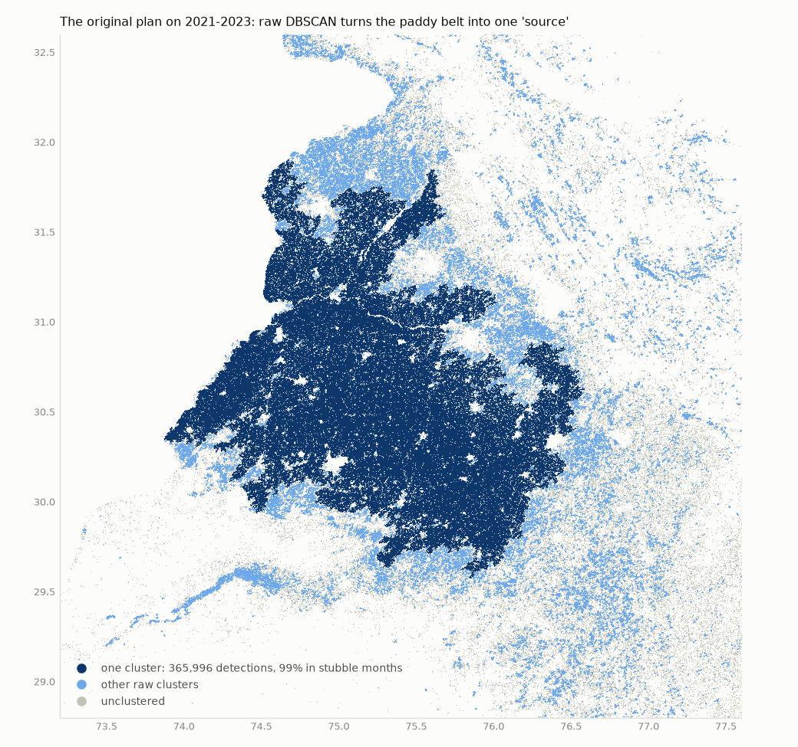
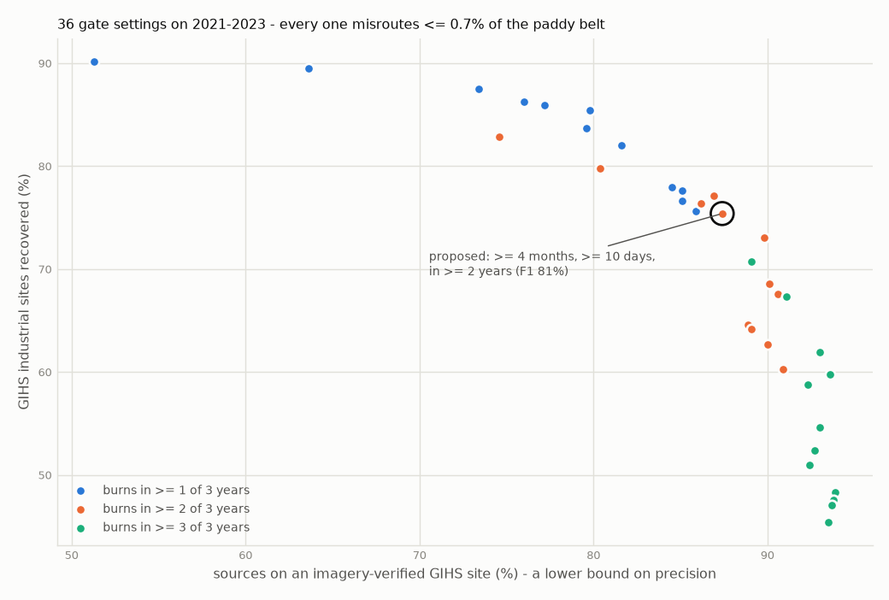
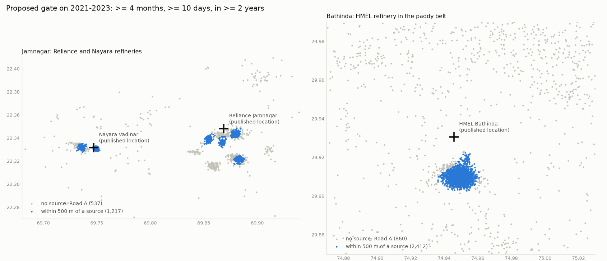

# Stage 1.5b — multi-year gate check, the demo refineries, and the label census

**Date:** 2026-09-29 · **Data:** all VIIRS detections over India, 2021–2023 (S-NPP +
NOAA-20), 3,906,061 detections
· **Scripts:** `scripts/spike_gate_multiyear.py`, `scripts/spike_labels.py`
· **Follows:** `reports/stage1_5_spike.md` (one year, 2023)

Three questions from the review of Stage 1.5:

1. The proposed gate requires a cell to burn in at least 2 years, but Stage 1.5 used one
   year, so that criterion was never exercised. Does the gate hold on real multi-year
   data?
2. Jamnagar is the demo centrepiece. Does it come out as a persistent source?
3. OSM has 22 flares, 5 steel plants and 3 cement plants in India. Which Model 1 classes
   can be trained honestly?

## Answers

**1. The gate holds, and the one-year proposal survives unchanged.** On three years,
the gate proposed from one — a 375 m cell burns in **≥ 4 months on ≥ 10 days, in at
least 2 of 3 years** — gives:
- **461 sources**
- **0.30%** of the Punjab paddy belt misrouted
- **75.4%** recall of active GIHS industrial sites, with **87.4%** of sources on a GIHS
  site. Both beat the one-year gate (65.4% and 82.6%).
- **98.9%** of FIRMS-static detections covered

The best-balanced setting of the 36 swept scores 0.7 F1 points higher, which is within
noise, so the pre-registered values stand. Requiring all 3 of 3 years is too strict:
recall falls to 45–71%, because flares aren't lit every year.

**2. Jamnagar comes out, both refineries of it.** At the recommended gate:

| Site | Registered source from the published point | Its detections covered (3 yr, within 3 km) |
|---|---|---|
| Reliance Jamnagar (22.348 N, 69.869 E) | 1.2 km | 81% of 944 |
| Nayara Vadinar (22.332 N, 69.747 E) | 0.3 km | 84% of 351 |
| HMEL Bathinda (29.931 N, 74.946 E) | 1.9 km | 92% of 1,452 |

All three are found at every gate setting tested. The review read Stage 1.5's "40% of
Jamnagar" as the refinery failing the gate. That figure was coverage of every
detection in a 40 × 60 km box, field fires included; the refinery's own flare groups
passed then too. One Reliance flare group near 22.315 N stays out because it didn't
burn in enough months across two years, which is why coverage is 81% and not 100%.

**3. Three industrial classes can be trained honestly; six cannot.** Counted where it
matters — how many *registry sources* sit within 1 km of a labelling OSM object:

| Group | Sources labelled | On a GIHS site | Verdict |
|---|---|---|---|
| Mining and coal fires | 153 | 85% | **Class** |
| Heavy industry (thermal power 39 + steel/cement 6 + other works 169) | 214 | 90% | **Class** — merged, see below |
| Oil and gas (refineries, oil fields, flares) | 28 | 96% | **Class, thin** — report its recall separately |
| Kiln | 2 | 50% | **Dropped** |
| Unlabelled | 64 | 80% | Predicted, never trained on |

The national count of 22 flares understated oil and gas. Refinery and oilfield polygons
label 28 sources, including Hazira, Haldia and HMEL. Steel, power and "other
industry" can't be told apart at integrated plants: Tata Steel Jamshedpur and the
Vedanta smelter at Jharsuguda are labelled "thermal power" by their own captive power
plants. So those three merge into one heavy-industry class. Both "kiln" labels are
wrong — one is a Raniganj coal-fire source — so the class goes.

**And a correction to Stage 1.5's correction.** Stage 1.5 found that one year of raw
DBSCAN broke the Punjab belt into field-scale clusters rather than one blob, and
concluded the "one giant source" prediction was wrong in form. **Three years show it
was right.**
- Raw DBSCAN on 2021–2023 puts **365,996 detections into a single cluster spanning the
  whole paddy belt** (29.6–31.9 N, 73.9–76.6 E; 400 km corner to corner).
- **99%** of that cluster's detections fall in the stubble months, and **0%** carry
  FIRMS' static flag.
- **97%** of the belt's detections would skip Road A, and 74.5% of all detections in
  India would.

One year was simply too little history.



## Data

| | |
|---|---|
| Files | FIRMS country yearly archive, S-NPP and NOAA-20, 2021–2023; 6 files, 309 MB; public, no key |
| Detections | 3,906,061 (2021: 1,536,734 · 2022: 1,198,449 · 2023: 1,170,878) |
| At night | 30.1% |
| Punjab paddy belt | 387,349 detections (box 29.9–31.7 N, 74.0–76.5 E) |
| Cells | 2,286,932 occupied 375 m cells |

## 1. The gate on three years

For each cell and year, the script counts the distinct days and distinct months with a
detection. A cell passes if at least *Y* of the 3 years have ≥ *M* months and ≥ *D*
days. Surviving cells are clustered with `DBSCAN(eps=500 m, min_samples=5,
sample_weight=detections)` under a 20 km footprint cap, as in Stage 1.5.

The sweep covered months 3–6 × days 5/10/20 × years 1–3, which is 36 settings. For
each one, the columns below measure:

| Column | Meaning |
|---|---|
| Punjab misrouted | Share of the belt's detections within 500 m of a source, excluding a 3 km zone around the HMEL refinery. Detections inside that zone are the refinery's own flares, not errors. |
| GIHS recall | Share of the 590 confirmed India GIHS objects active in 2021 that have a source within 1 km |
| On GIHS | Share of sources within 1 km of a confirmed GIHS object. GIHS stops in 2021 and isn't exhaustive, so this is a lower bound on precision. |
| F1 | Balances GIHS recall against the on-GIHS share |

Selected settings (all 36 are in `reports/stage1_5b/tables.md`):

| Years | Months | Days | Sources | Punjab misrouted | GIHS recall | On GIHS | F1 | Reliance | Nayara | HMEL |
|---|---|---|---|---|---|---|---|---|---|---|
| 1 | 3 | 5 | 1,068 | 0.70% | 90.2% | 51.3% | 65.4% | 97% | 93% | 96% |
| 1 | 4 | 10 | 636 | 0.32% | 85.9% | 77.2% | 81.3% | 90% | 90% | 96% |
| 2 | 3 | 5 | 621 | 0.34% | 82.9% | 74.6% | 78.5% | 94% | 93% | 96% |
| 2 | 3 | 10 | 482 | 0.30% | 77.1% | 86.9% | **81.7%** | 81% | 87% | 94% |
| **2** | **4** | **10** | **461** | **0.30%** | **75.4%** | **87.4%** | **81.0%** | **81%** | **84%** | **92%** |
| 2 | 6 | 10 | 385 | 0.30% | 67.6% | 90.6% | 77.4% | 62% | 45% | 73% |
| 3 | 4 | 10 | 327 | 0.29% | 59.8% | 93.6% | 73.0% | 62% | 45% | 58% |



**How the setting was chosen.** Three constraints came first, all fixed before
looking at the results:
- recurrence in at least 2 years, which keeps a single long accident like Baghjan out
  of the registry
- no more than 2% of the paddy belt misrouted
- all three refineries found

Among the settings that pass, the gate proposed from one year was kept, because it is
within one F1 point of the best (81.0% vs 81.7%). Picking the sweep's top scorer would
mean tuning to noise in 36 settings. A first draft of the script maximised recall
alone and chose 2/3/5, but that setting puts a quarter of its sources off any GIHS
site, so it was replaced by the balanced rule.

What the sweep shows:
- **The paddy belt is safe at every setting (0.24–0.70% misrouted).** The belt burns
  in short seasons, so any month threshold excludes it. The years requirement buys
  *precision*: it drops one-season hotspots that are not paddy.
- **Requiring all three years is too strict.** Flares are intermittent in VIIRS, so
  recall falls to 45–71% and Nayara's coverage to 45%.
- **Multi-year history improves both recall and precision** over one year (75.4% and
  87.4%, against 70.8% and 79.9% for the same thresholds on one year).

## 2. The demo refineries



- **Reliance Jamnagar.** Four flare groups are registered around the published point
  and cover 81% of 944 detections. A fifth group, near 22.315 N, 69.855 E, burned in too
  few months to pass and stays on Road A. If it flares heavily, Road A's rules will
  still flag it as industrial, because it lies inside the refinery.
- **Nayara Vadinar.** One source, 0.3 km from the published point, covering 84% of 351
  detections.
- **HMEL Bathinda.** One ~2 km source covering 92% of 1,452 detections, while the
  387,349 paddy-belt detections around it go to Road A.

## 3. Raw DBSCAN on three years: the original plan, re-tested

| | 2023 only | 2021–2023 |
|---|---|---|
| Detections | 1,170,878 | 3,906,061 |
| Raw clusters (≥ 5 detections) | 33,963 | 87,065 |
| Clusters wider than 10 km | 32 | 825 |
| Widest | 19.7 km | **400.4 km** (the paddy belt) |
| Punjab detections inside a "source" | 57.4% | **97.0%** |
| Punjab detections in blobs > 10 km | 1.1% | **90.3%** |
| All India detections skipping Road A | 46.2% | **74.5%** |
| Peak extra memory | 1,258 MB | 7,824 MB |
| Time | 11 s | 310 s |

With more history, the gaps between fields fill in and the belt links up. That was
the mechanism the review predicted. The one-year "ten-year stand-in"
(`min_samples=1`, 31 km widest) understated it badly, as its own caveat warned.

**Memory, re-measured.** 3.3× the data cost 6.2× the memory, a growth exponent of
1.5 — the same as the two-satellite measurement in Stage 1.5. The full 2012–2024 VIIRS
archive (~20 sensor-years, 3.3× this data) would need about **48 GB**, the low end of
Stage 1.5's 45–70 GB estimate. The neighbour lists alone grew with exponent 1.65,
not the 1.9 seen between satellites: fields burn in different places each year, so
years overlap less than two satellites viewing the same year.

## 4. Label census and the proposed Model 1 classes

The census is `scripts/spike_labels.py` and `reports/stage1_5b/labels.md`:
- It takes the 461 sources from the recommended gate, with all their member cells.
- It labels each source by the first OSM group with an object within 1 km, in priority
  order: oil & gas, steel/cement, thermal power, mining, kiln, other industry.
- The OSM data is a one-off Overpass pull restricted to India, which is fine for a
  count. The production ingest still uses the Geofabrik extract, per CLAUDE.md.
- WRI's Global Power Plant Database independently finds coal, gas or oil plants within
  1 km of 46 sources, the same number OSM gives (46 near thermal plants).

| Group | OSM objects in India | Sources near any | Primary label | Detections | On a GIHS site |
|---|---|---|---|---|---|
| oil_gas | 134 | 28 | 28 | 24,784 | 96% |
| steel_cement | 39 | 6 | 6 | 6,379 | 100% |
| thermal_power | 375 | 46 | 39 | 87,412 | 92% |
| mining | 11,956 | 169 | 153 | 182,444 | 85% |
| kiln | 5,617 | 8 | 2 | 9,048 | 50% |
| industrial_other | 33,366 | 309 | 169 | 96,324 | 90% |
| unlabelled | — | — | 64 | 23,138 | 80% |

**Proposed Model 1 classes for Stage 4:**

1. **Mining and coal fires** — 153 labelled sources (Jharia, Talcher, Raniganj…). The
   report must say that coal-seam fires are fires *in* mines, not mining activity.
2. **Heavy industry** — 214: thermal power, steel, cement, smelters and other works,
   merged because captive power plants make them inseparable by label.
3. **Oil and gas** — 28: refineries, oil and gas fields, flares. It is the thinnest
   class but the one NTRO cares most about, so its recall is reported separately.
   If it falls below a usable level, the map falls back to naming the nearest OSM oil
   and gas facility. That is a display lookup, not a learned class.

Other decisions that follow:
- **Dropped:** kiln (2 labels, both wrong). Flare and furnace fold into oil and gas
  and heavy industry.
- **Recurrent biomass as a fourth class** only if Stage 2's WorldCover sampling finds at
  least ~30 registry sources on cropland or forest with no industrial label. At this
  gate, 87% of sources sit on GIHS industrial sites, so it may not be needed.
- **The 64 unlabelled sources** (80% on GIHS, so mostly industry OSM hasn't mapped,
  like the Upper Assam oilfields near Baghjan) are predicted, never trained on.
- **GIHS stays evaluation-only.** It appears here only as the "on a GIHS site" column,
  never as a label, so the 83–87% figures remain independent.

**This doesn't change deliverable (i).** Industrial vs forest vs agricultural at the
detection level comes from the registry, Road A's land-cover and season rules, and
Road C, not from Model 1's sub-types. Model 1 answers the next question: *what kind of*
industrial source.

## Caveats

- Three years, not the full archive. Stage 3 recalibrates on 2012–2024; the targets
  below are floors.
- The site checks use published coordinates, which are nominal points for complexes
  several kilometres across. The 3 km radius is a judgement.
- The on-GIHS share is a lower bound on precision.
- The label census uses a 1 km radius and a priority order. Both introduce noise, and
  the examples above show some.
- Punjab misrouting excludes a 3 km zone around HMEL, so the refinery's own flares are
  not counted as errors.

## Starting targets for Stage 3's `check_registry.py`

Stage 3 recalibrates on the full archive; it must at least meet these:
- GIHS recall **≥ 75%** of active objects
- **≥ 85%** of sources on GIHS sites
- Punjab paddy belt misrouted **≤ 1%**
- FIRMS `type=2` recall **≥ 98%**
- Reliance, Nayara and HMEL all found within 3 km

## Reproduce

```bash
python scripts/spike_gate_multiyear.py           # ~6 min + ~5 min for the raw rerun
python scripts/spike_gate_multiyear.py --skip-raw
python scripts/spike_labels.py                   # after the above; OSM cached in data/raw/osm_census
```

The first run downloads the 2021–2022 files (~217 MB) next to the 2023 ones.
