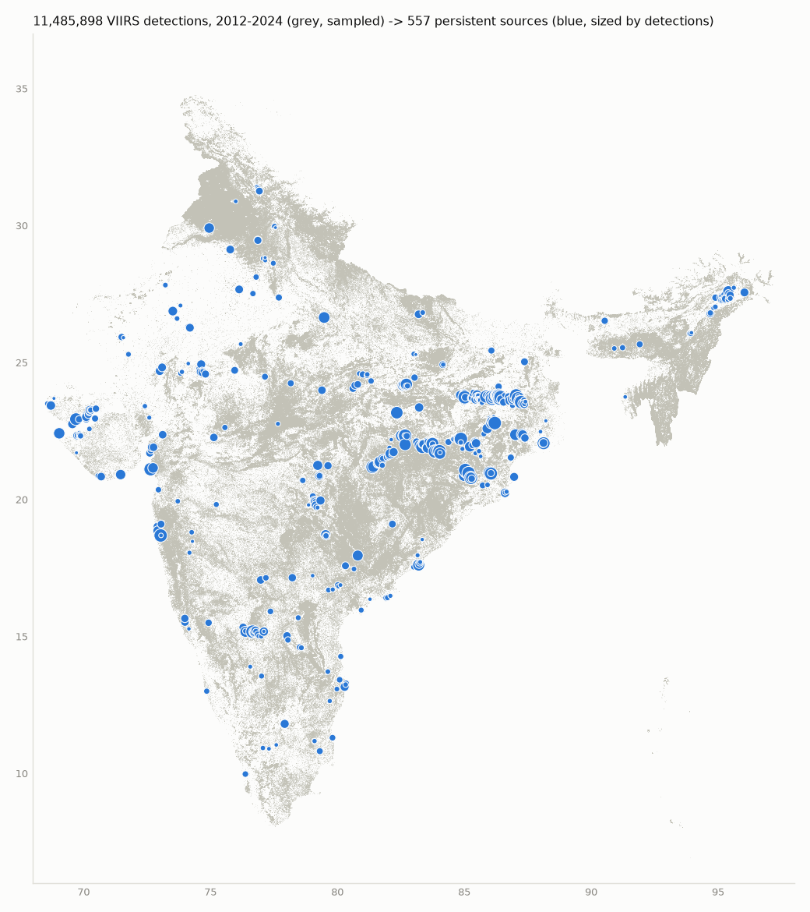
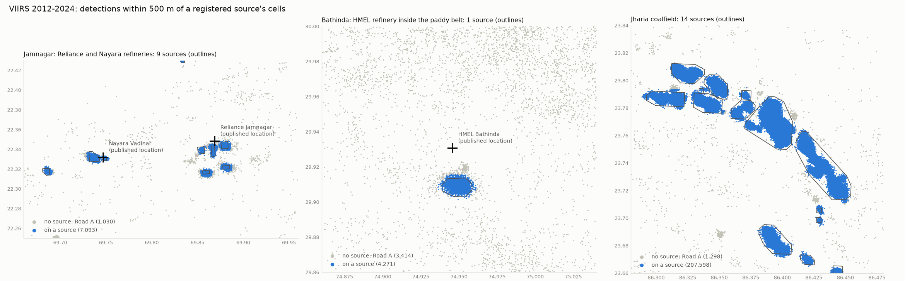

# Stage 3 — the registry on the full archive

Built 2026-09-29 from every VIIRS detection over India, 2012–2024 (11,485,898), with
MODIS (1,068,405) feeding its own baselines. Code: `firewatch/registry/`; commands:
`make registry` (build, then `scripts/check_registry.py`), and
`scripts/build_registry.py --sweep` for recalibration.

## Result

**557 persistent sources**, made of 2,745 gated 375 m cells. The build takes 99 s in
memory, then one transaction writes them. Every acceptance floor passes.

| Check | Floor | Result |
|---|---|---|
| GIHS recall (confirmed India objects active in 2021, within 1 km) | ≥ 75% | **83.4%** |
| Sources on a confirmed GIHS object (a lower bound on precision) | ≥ 85% | **86.2%** |
| Punjab paddy belt on a source (outside 3 km of HMEL) | ≤ 1% | **0.014%** (of 1,342,514) |
| FIRMS `type=2` detections on a source (evaluation only) | ≥ 98% | **99.3%** |
| Reliance Jamnagar: nearest source cell | ≤ 3 km | **0.72 km** |
| Nayara Vadinar: nearest source cell | ≤ 3 km | **0.25 km** |
| HMEL Bathinda: nearest source cell | ≤ 3 km | **2.1 km** |
| Widest source | ≤ 20 km cap | **8.0 km** (nothing capped) |
| Persistence in [0, 1], positive at night or by day | all | **all 557** |
| Source-wide baseline present | all | **all 557** |

Also measured:
- **Recall of all confirmed GIHS objects:** 72.5%, including those that stopped
  before 2021.
- **Share of detections on a source:** 12.5% of VIIRS and 5.0% of MODIS. Everything
  else goes to Road A.
- **Night persistence:** median 0.23, largest 0.955. The big coal, steel and refinery
  complexes sit at 0.94–0.96.
- **Day persistence:** median 0.006. Small industrial sources are rarely detected
  against a sunlit background.
- **Co-located GIHS objects merged:** 185 of our sources each contain two or more
  confirmed GIHS objects, 469 objects in all. GIHS draws a plant as several objects
  (kilns, flares, stacks). At 500 m we cannot, and should not, split them: a baseline
  covers the whole site.

## The gate moved to three years

The recalibration rule was written into `docs/ROADMAP.md` before the sweep ran:
- keep the approved gate (≥ 3 months, ≥ 10 days, ≥ 2 years) if it meets every floor
- otherwise take the passing setting with the best F1 of GIHS recall and the on-GIHS
  share

On 13 years the two-year gate registers **679 sources, only 79.5% on a GIHS site**,
below the 85% floor. Two qualifying years out of thirteen is a much looser test than
two out of three. The best passing setting is **≥ 3 months, ≥ 10 days, in ≥ 3 years**:
557 sources, F1 84.8. It is now the config default (`REGISTRY_GATE=3,10,3`, DESIGN.md
decision 19). A multi-year rule still keeps a single long accident (Baghjan)
out by construction.

Full table: [stage3/sweep.md](stage3/sweep.md). A trade-off to note: raising the days
threshold to 20 buys precision (up to 93% on GIHS), but recall falls below the floor
and Jamnagar's nearest cell moves from 0.72 km to about 1.2 km.

## Findings worth carrying forward

- **A day-shift plant.** Source 93 is the Bajaj Auto works at Waluj, Aurangabad, on a
  confirmed GIHS site. All 258 of its VIIRS detections are on the morning pass: a
  real industrial source that is never seen at night. The acceptance wording
  "persistence in (0, 1] at night" could not hold for it. The check now asks for both
  ratios in [0, 1] and at least one of them positive. Night share is a feature, so
  Model 1 sees this directly.
- **HMEL** is registered 2.1 km south of its published infobox point, where the flares
  are. The complex is large; the published point is nominal.
- **Jharia** is 14 sources, one per fire zone. It is not one blob and not dozens of
  fragments.
- **MODIS assignment radius.** MODIS detections are assigned at 1 km (VIIRS at
  500 m), because MODIS pixels are 1 km at nadir. MODIS feeds only the `MODIS|…`
  baselines. The gate, the clusters and the fingerprints are VIIRS-only.
- **The label census (Stage 1.5b) was taken on the 477-source, three-year registry.**
  Stage 4 recounts it on these 557.

## What is stored

- **`sources`:** one row per source.
  - Detection-weighted centre, and a convex-hull footprint of its cells.
  - First and last seen, and the detection count.
  - `fingerprint` JSONB: 26 thermal and temporal features, none of them location.
  - `baselines` JSONB: median / MAD / p99 / n per `instrument|daynight|season` with
    n ≥ 30, then `instrument|daynight`, then source-wide `*`.
- **`source_cells`:** the cells, which are what the router measures its 500 m
  against.
- **`detections.source_id`:** each detection's source, for 1,492,347 detections.
- **`registry_runs`:** the gate and the statistics of each build.
- **Stable source ids across rebuilds.** Each new cluster keeps the id of the old
  source it shares the most cells with. A rebuild never clears `provisional` and never
  deletes a provisional source; that belongs to Stage 5.
