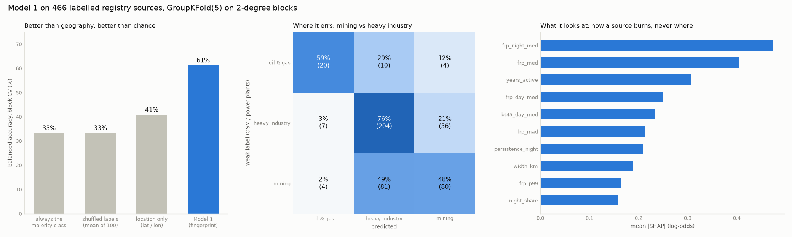

# Stage 4 — weak labels and Model 1

Trained 2026-09-29 on the 557-source registry (Stage 3). Commands: `make labels`
(`scripts/build_labels.py`) and `make train` (`scripts/train.py`). Everything is in
[model1_metrics.json](model1_metrics.json); the rules below were written into
`docs/ROADMAP.md` after labelling and before any training ran.

## Result

| | Accuracy | Balanced accuracy | Macro-F1 |
|---|---|---|---|
| **Model 1** — thermal fingerprint only | **65.2%** | **61.2%** | **0.62** |
| Location only (lat/lon; a reference, never a feature) | 55.6% | 40.8% | 0.41 |
| Shuffled labels (mean of 100) | — | 33.3% (max 41.7%) | — |
| Always "heavy industry" | 57.3% | 33.3% | — |

All scores are out-of-fold, from 5-fold GroupKFold on 2° blocks: 466 labelled sources
in 58 blocks. Sources cluster (Jharia alone is 14), so a random split would test the
model on the twin of a training source. The permutation test gives **p ≈ 0.01**:
none of 100 shuffled-label runs came near.

| Class | Precision | Recall | Sources |
|---|---|---|---|
| oil and gas | 64.5% | **58.8%** | 34 |
| heavy industry | 69.2% | 76.4% | 267 |
| mining | 57.1% | 48.5% | 165 |

- **Oil and gas is usable.** Recall and precision both clear the 50% bar set before
  training, so it stays a class; the nearest-facility fallback is not needed.
- **Mining vs heavy industry is where the model errs.** 81 of 165 mining sources are
  called heavy industry. Label noise is a large part of it:
  - 119 labelled sources are *contested*, with evidence for two classes within 1 km.
    Usually this is a mine, or a refinery, inside an industrial estate.
  - The model is right on 70% of uncontested sources and 52% of contested ones.
- **Against the published 77%** (Liu et al. 2018, industrial sub-types, global): that
  number used VIIRS Nightfire temperature, the strongest discriminator between flares
  (~1,800 K), furnaces and smouldering coal. Our four temperature features are empty
  until the VNF licence arrives. The gap is expected, and closing it is the clearest
  next gain.

At the demo sites, the final model calls Reliance Jamnagar, Nayara Vadinar and HMEL
Bathinda oil and gas (0.99, 0.95, 0.98) and Jharia mining (0.83). Those sources were
in its training set, so this shows consistency, not accuracy; the table above is the
accuracy.

## What it looks at

Mean |SHAP| on the final model. These are the reasons an analyst can check:
- **Oil and gas:** night-time FRP and median FRP. Flares are bright, and brightest
  against a cold night.
- **Mining:** years active and footprint width. Coal-seam fires spread over
  kilometres and burn for years.
- **Heavy industry:** night persistence. Furnaces and power plants run through the
  night, every night.

## The labels

Built only from location, within 1 km of any cell of a source, most specific first:
oil_gas > steel_cement > thermal_power (OSM or WRI GPPD combustion plants) > mining >
kiln (no label) > industrial_other.

| Class | Sources | From |
|---|---|---|
| heavy industry | 267 | industrial_other 183, thermal_power 77, steel_cement 7 |
| mining | 165 | `landuse=quarry`, `resource=coal`, `industrial=mine`, `man_made=mineshaft` |
| oil and gas | 34 | refinery, oil, petroleum well and flare tags |
| no label | 91 | 89 with no evidence (79% on GIHS sites: unmapped industry); 2 kiln-first |

The unlabelled 91 are predicted: heavy industry 66, mining 25.

**The biomass class was not added.**
- The rule was to add `recurrent_biomass` if at least 30 unlabelled sources sat on
  WorldCover cropland or tree cover. 42 did.
- GIHS, used only for evaluation, puts **81% of them on imagery-confirmed industrial
  sites**: 92% of the tree-cover ones and 62% of the cropland ones. They are mines and
  plants in forested or farmed country that OSM has not mapped.
- Training on those labels would have taught the model that unmapped industry is crop
  burning. The class now also needs fewer than half its candidates on confirmed
  industry (DESIGN.md, decision 20). GIHS decides only whether the class
  exists; it never labels a source.
- Recurring biomass does not survive the registry gate. That is the gate doing its
  job: stubble and forest fires are Road A's to classify.

## The leakage guard

`scripts/train.py` stops before reading any data if `FEATS` shares a name with the
label inputs, location in any form, or the evaluation-only references (FIRMS `type`,
GIHS). A test injects each kind and checks that it fails. Two further exclusions:
- **Absolute brightness temperatures** (`bt4_*`, `bt5_*`) carry the background's
  climate, which makes them a location proxy. The I4 − I5 contrast carries the fire
  and is used.
- **The location-only reference** shows what learning geography would score under the
  same folds: 40.8% balanced. Model 1's margin over it is fingerprint.

Hyperparameters are fixed and plain (depth 3, 300 trees, learning rate 0.05, balanced
class weights), and none were tuned on these scores. The model is saved under
`DATA_DIR/models/`, which is not committed; its predictions are in `sources.cls` /
`cls_conf`.
