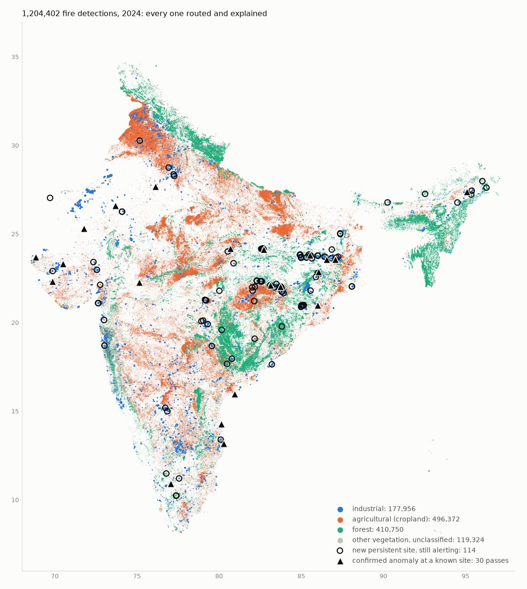

# Stage 5 — router and inference

Every detection answers one question: *is there a known source within 500 m?*
- **No → Road A.** Rules plus physics, each rule writing its reason.
- **Yes, inside its envelope → Road B.** Normal operation.
- **Yes, breaching its own baseline → Road C.** A provisional alert on one extreme pass;
  a confirmed alert on two consecutive breaching passes.

Road A sites that keep burning are promoted to provisional sources, which alert on
every pass and are never Road B.

Code: `firewatch/inference/` (`router`, `road_a`, `anomaly`, `promotion`, `engine`).
Commands:
- `make inference` (`scripts/run_inference.py`) replays the latest archive year.
- `scripts/check_injected.py` scores Road C against spikes injected into real source
  histories.
- `scripts/check_baghjan.py` is the regression test.

The rules below were written into `docs/ROADMAP.md` before anything ran. Three changed
after the first real results, for reasons given here and in the DESIGN.md decision
log, 22–25.

## The 2024 replay

`make inference` replayed every detection of 2024 (1,204,402) as if it were arriving
live: day by day, with baselines from 2023 and earlier, and promotions in simulated
time. It computes in about 4 minutes and writes in about 7–15. **Every Road A detection
carries a reason** (0 without one).

| Road | Detections | Share |
|---|---|---|
| A: no known source | 1,039,512 | 86.3% |
| B: normal at a known source | 154,515 | 12.8% |
| C: alert | 10,375 | 0.86% |

| Category (deliverable i) | Detections |
|---|---|
| agricultural (cropland) | 496,372 |
| forest | 410,750 |
| **industrial** (Road B/C at registry sources, plus Road A near mapped industry) | **177,956** |
| other vegetation | 109,005 |
| unclassified: built-up, bare or water, each saying why | 10,319 |

**Road C, 2024:**
- 30 passes raised a confirmed anomaly at a registry source, and 0 an extreme
  (provisional) one.
- 115 Road A sites were promoted to provisional sources. They carry 10,331 detections
  that alert on every pass (`new_source`), and 49 went quiet for 90 days and were
  retired.
  - 63 of the 115 are industrial by Road A's rules: mining 46, other industry 13, heavy
    industry 4. 41% sit on a GIHS-confirmed industrial site.
  - They are persistent fires the registry cannot hold yet, because its gate needs
    three years.
  - The other 50 are persistent fires on forest or crop land cover. Many are in the
    mining belt, likely coal fires under tree cover; some near cities are likely
    landfills.
  - January's 19 promotions are partly an artefact: a replay starts with no promotion
    memory, so sites that were already burning get promoted in its first weeks.
- Stage 6 turns each provisional source into one open event rather than an alert per
  pass. What an analyst would see is ~115 events for the year, not 10,331 pings.

**Two Road A rules were tightened after the first replay.** Its map showed industrial
dots across the Punjab paddy belt and along the Brahmaputra:

| Rule path, 2024 | First replay | After |
|---|---|---|
| Generic industry (`landuse=industrial`, works, factory) within 375 m | 7,298 industrial (47% in stubble months) | 1,633: only on built-up or bare land. The other 5,665 fall through to land cover, reason noting the plot nearby |
| "Offshore" from a water pixel | 2,915 | 0: water at ~300 m is rivers, char lands and wetlands, now unclassified with that reason. Offshore means open sea only |

Specific facilities (refinery, steel, power, mine, kiln) keep the 375 m rule. Fires
*inside* a generic industrial polygon stay industrial: 8,967, half of them in stubble
months. Rice mills burn husk in their own yards, so that is defensible, but it is the
next place to look.

## Road C against injected spikes

For a test year, each registry source's baselines come only from its passes *before*
that year. Up to three events per source (975 in 2024) are injected into its real pass
sequence: 6–12× its median, on two consecutive real passes, with its own cloud gaps
(`fixture.inject_spikes`). False-positive rates come from the same year without
injection. Real incidents in it count against us, so they are upper bounds.

| 2024 (baselines from ≤ 2023; nothing tuned on it) | Target | Result |
|---|---|---|
| Confirmed recall: the event's second pass raises a confirmed alert | > 90% | **88.2%** ✗ |
| Confirmed false positives, share of 79,114 passes | < 0.1% | **0.040%** (32 alerts) ✓ |
| Provisional false positives | < 0.01% | **0.000%** (0 alerts) ✓ |

2023, with baselines from ≤ 2022: confirmed recall 87.8%, confirmed false positives
0.083%, provisional 0.006%.

**The recall target is missed by 1.8 points, and the cause is known.**
- The breach test sees **92%** of injected spikes on their first pass.
- About half of the misses (57 of 975 events) fall to the non-negotiable
  `frp > 1.5 × p99` condition. These are sources so heavy-tailed in normal operation
  that 6–12× their median stays under 1.5× their p99.
- That condition is kept on purpose: it and the z-score fail differently (DESIGN.md §3.4).
  So this is reported, not tuned away.

**How the design moved from the first run (24 h window, source-wide fallback) to this
one:**

| | Confirmed recall 2024 | Confirmed FP 2023 | Confirmed FP 2024 |
|---|---|---|---|
| First run: "consecutive" within 24 h; source-wide fallback | 55.0% | 0.134% | 0.047% |
| No clock on "consecutive" | 90.0% | 0.161% | 0.059% |
| + a pass judged only against its own instrument (final) | **88.2%** | **0.083%** | **0.040%** |

- **"Consecutive" has no clock now.** That is the design's literal rule; the 24 h window
  was an implementation addition. A weak source is not detected on every overpass: 38% of the injected events
  had their two passes more than 24 h apart. The window cut recall by 35 points and
  bought nothing.
- **Own-instrument baselines.** Most 2023 confirmed false positives were MODIS passes
  judged against the source-wide pool, which is mostly VIIRS, and MODIS only detects the
  bigger fires. Judging a pass only against its own instrument halved them.

**The extreme (provisional) tier had to go to 6× p99.** Calibrated on 2023 by the rule
fixed in advance, as the setting with the best single-pass recall that keeps false
alerts under 0.01%:

| Extreme tier (z > 7) | 3× p99 | 4× | 5× | **6×** |
|---|---|---|---|---|
| False alerts, share of 2023 passes | 0.045% | 0.019% | 0.011% | **0.006%** |
| Single-pass spikes caught | 61.7% | 40.3% | 20.3% | **7.8%** |

At 6× the tier almost never fires, false or true. At 3× it would catch 62% of one-pass
blasts, at about 40 false alerts a year across 557 sources. **This is an operational
decision, not a statistical one** (`ANOMALY_EXTREME=7,3` flips it).

Many "false" alerts look real. In January 2023 HMEL Bathinda breached day and night for
three weeks, and on 13 February 2023 Panipat was flagged by MODIS and NOAA-20 on the
same night. Without a verified event list (Stage 10), they count against us.

## Baghjan

The regression test: `scripts/check_baghjan.py` replays April–December 2020 around
the well.
- **The fire point.** The published coordinates (Wikipedia, 27.604 N 95.405 E) mark a
  neighbouring persistent flare, which is registry source 549. The fire itself is where
  its 557 VIIRS detections cluster between the published dates: 27.596 N 95.379 E,
  2.7 km away, σ ≈ 300 m. The same months of 2019 had 3 detections there.
  `reference/verified_events.csv` records both points.

| | Calendar-day promotion (≥ 20 days) | Observable-day promotion (adopted) |
|---|---|---|
| Promoted to a provisional source | 14 Aug 2020, **66 days** after it caught fire | 30 Jun 2020, **21 days** after |
| Fire detections on Road A before that | 175 | 78 |
| On Road C (`new_source`) | 470 | 567 |
| On Road B | **0** | **0** |

**It is never Road B, so the test passes either way.** Counting observable days, as
the design requires for all persistence, turns a two-month blind spot into three weeks.
Before promotion, Road A called the fire forest, vegetation or cropland: the pixel's
land cover. No oil well within 375 m is mapped in OSM, which is exactly the gap
promotion exists to close.
